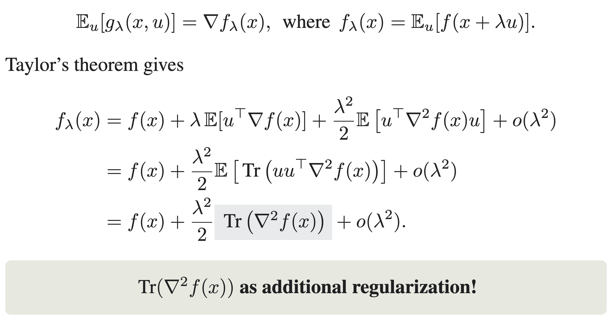

## Zeroth-Order Optimization Finds Flat Minima

The code is for reproducing all experiment results in the [paper](https://arxiv.org/abs/2506.05454).
We show that zeroth-order optimization with the standard two-point estimator favors solutions with small trace of Hessian.


We further provide convergence rates of zeroth-order optimization to approximate flat minima for convex and sufficiently smooth functions.
Experiments on test functions, binary classification tasks with convex losses, and language model fine-tuning support our theoretical findings.


### Test Function

Code for Figures 1 and 4 on the test function $(y^\top z - 1)^2/2$ is provided in the directory `./test_func` and requires the package `numpy`. Usage:
```bash
cd ./test_func
mkdir ./res
python run_toy.py
```
Results will be stored at `./test_func/res` as `json` files.


### Binary Classification with SVMs and Logistic Regression

Code for Figures 2 and 5 is provided in the directory `./svm_logreg` and requires the packages `numpy`, `scikit-learn`, and `wandb`. The datasets `a5a` and `w5a` need to be already downloaded from [here](https://www.csie.ntu.edu.tw/~cjlin/libsvmtools/datasets/binary.html) and exist at `./svm_logreg/data`. Usage:
```bash
cd ./svm_logreg
mkdir ./res_logreg
mkdir ./res_svm
nohup bash train_logreg.sh > logreg.out &
nohup bash train_svm.sh > svm.out &
```
Results will be stored at `./svm_logreg/res_logreg` and `./svm_logreg/res_svm` as `json` files.


### Fine-Tuning Language Models on Text Classification Tasks

Code for Figures 3 and 6 is provided in the directory `./roberta` and is tested on `python 3.9.18`, with `torch==2.4.0+cu121` and `transformers==4.28.1`.
Our implementation is based on [MeZO](https://github.com/princeton-nlp/MeZO).
Usage:

1. Create the environment (replace `env_name` by any name)

```bash
cd ./roberta
conda env create -n env_name -f environment.yml
conda activate env_name
```

2. Prepare the data
```bash
cd ./data
bash prepare_datasets.sh
```

3. Run the examples

```bash
cd ..
nohup bash examples/flat-zo.sh > zo.out &
nohup bash examples/flat-gd.sh > gd.out &
```
Results will be stored at `./roberta/zo.out` and `./roberta/gd.out`.


### Citation

```bibtex
@article{zhang2025zeroth,
  title={Zeroth-Order Optimization Finds Flat Minima},
  author={Zhang, Liang and Li, Bingcong and Thekumparampil, Kiran Koshy and Oh, Sewoong and Muehlebach, Michael and He, Niao},
  journal={Advances in Neural Information Processing Systems},
  year={2025}
}
```
